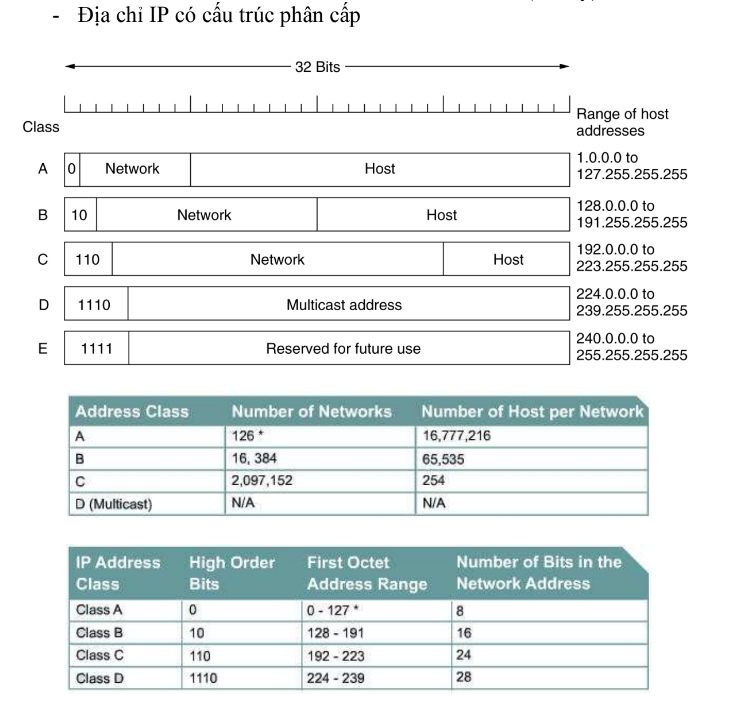

# OSI

#### Giới thiệu:

* 1984 mô hình OSI (Open System Interconnection)
  ra đời, do tổ chức Tiêu chuẩn hóa quốc tế (ISO) xây
  dựng.
* Mô hình OSI là một tập các mô tả chuẩn cho phép
  các máy tính khác nhau giao tiếp với nhau theo
  cách mở.
* Mô hình OSI phân chia kiến trúc mạng máy tính
  thành 7 tầng: tầng Vật lý, tầng Liên kết Dữ liệu ,
  tầng Mạng, tầng Giao vận, tầng Phiên, tầng Trình
  diễn và tầng Ứng dụng.

> Mô hình OSI sử dụng cấu trúc phân tầng để giảm độ phức tạp.
>
> Nguyên tắc của kiến trúc mạng phân tầng:
>
> 1. Mỗi hệ thống trong một mạng đều có cấu trúc tầng như nhau.
> 2. Dữ liệu không được truyền trực tiếp từ tầng I của hệ thống này sang tầng I của hệ thống kia (ngoại
>    trừ tầng thấp nhất).
> 3. Giữa hai hệ thống kết nối chỉ ở tầng thấp nhất mới có liên kết vật lý.

### **Các lớp trong mô hình OSI**

#### **Application layer**

Tầng ứng dụng là tầng gần với người sử dụng nhất. Nó cung cấp phương tiện cho người dùng truy nhập các thông tin và dữ liệu trên mạng thông qua chương trình ứng dụng. Tầng này là giao diện chính để người dùng tương tác với chương trình ứng dụng, và qua đó với mạng.

Một số ví dụ về các ứng dụng trong tầng này bao gồm Telnet, Giao thức truyền tập tin FTP và Giao thức truyền thư điện tử SMTP, HTTP, X.400 Mail remote...

#### **Presentation layer**

Lớp trình diễn hoạt động như tầng dữ liệu trên mạng. lớp này trên máy tính truyền dữ liệu làm nhiệm vụ dịch dữ liệu được gửi từ tầng Application sang dạng Fomat chung. Và tại máy tính nhận, lớp này lại chuyển từ Fomat chung sang định dạng của tầng Application.

Lớp thể hiện thực hiện các chức năng sau: Dịch các mã kí tự từ ASCII sang EBCDIC. Chuyển đổi dữ liệu. Nén dữ liệu để giảm lượng dữ liệu truyền trên mạng. Mã hoá và giải mã dữ liệu để đảm bảo sự bảo mật trên mạng.

#### **Session layer**

Nhiệm vụ của lớp này là thiết lập, duy trì và kết thúc giao tiếp với các thiết bị nhận

#### **Transport layer**

Lớp này duy trì kiểm soát dòng chảy của dữ liệu và thực hiện kiểm tra lỗi và khôi phục dữ liệu giữa các thiết bị.

Thực hiện việc ghép kênh, phân kênh cắt hợp dữ liệu.

Tạo ra một kết nối cho mỗi yêu cầu của tầng trên nó.

 Ví dụ phổ biến nhất của tầng giao vận là Transmission Control Protocol (TCP) và User Datagram Protocol (UDP).

#### **Network layer**

Cung cấp địa chỉ logic mà router sẽ sử dụng để xác định đường đi đến đích.Trong hầu hết các trường hợp, địa chỉ logic ở đây có nghĩa là các địa chỉ IP (bao gồm nguồn & địa chỉ đích IP.

Lập địa chỉ các thông điệp, diễn dịch địa chỉ và tên logic thành các địa chỉ vật lý.

Kiểm soát và điều khiển đường truyền.

Quản lý lưu lượng trên mạng.

Kiểm soát luồng dữ liệu và cắt hợp dữ liệu.

#### **Datalink layer**

Cung cấp phương tiện để truyền thông tin
qua liên kết vật lý đảm bảo tin cậy.

* Các bước tầng liên kết dữ liệu thực hiện:
* Chia nhỏ thành các khối dữ liệu frame.
* Sửa lỗi trong quá trình truyền tin(do bản tin bị hỏng, mất, và truyền lại)
* Giữ cho sự đồng bộ tốc độ giữa bên phát và bên thu

#### **Physical layer**

* Truyền tải các bit thông tin qua đường truyền vật lý.
* Việc thiết kế phải đảm bảo nếu bên phát, phát bít 1 thì bên thu cũng phải nhận bít 1.
* Quy định rõ mức điện áp biểu diễn dữ liệu
* Chiều truyền tin
* Định nghĩa các kết nối cáp với các mạng

Lớp vật lý cung cấp phương tiện điện, cơ, chức năng và thủ tục để thiết lập, duy trì và giải phóng liên kết vật lý giữa các hệ thống.
Thuộc tính điện: biểu diễn các bit (các mức điện áp của tín hiệu).
Thuộc tính cơ: tính chất vật lý của giao diện đường truyền như kích thước, cấu hình, cách đấu nối ..
Các chức năng của phần tử giao diện vật lý
Thuộc tính thủ tục: điều khiển đường truyền để truyền tải các chuỗi bit
Đặc điểm khác biệt cơ bản của lớp vật lý so với các lớp khác là: lớp thấp nhất nên không có PDU, không có tiêu đề gói tin, dữ liệu đươc truyền đi theo dòng bit.
Môi trường truyền tin: đường truyền vật lý

### Phương thức hoạt động

#### A,Phía máy gửi đi thông tin

**Tầng 7**

Người dùng đưa thông tin cần gửi vào máy tính. Các thông tin này thường có dạng như: hình ảnh, văn bản...Sau dố thông tin dữ liệu được chuyển xuống tầng 6.

**Tầng 6**

Tầng này sẽ chuyển các dữ liệu thành một dạng chung để mã hóa dữ liệu và nén dữ liệu và chuyển xuống tầng 5.

> Chuyển đổi Định dạng Dữ liệu
>
> Một ứng dụng có thể sử dụng hình ảnh JPEG, và tầng Presentation có thể chuyển đổi hình ảnh này sang định dạng chuẩn như Base64 để dễ dàng xử lý và truyền tải.
>
> Mã hóa và Giải mã Dữ liệu
>
> Ví dụ: Mã hóa hình ảnh bằng một thuật toán như AES (Advanced Encryption Standard) trước khi gửi và giải mã sau khi nhận được.
>
> Nén và Giải nén Dữ liệu
>
> Ví dụ: Sử dụng các thuật toán nén như gzip để nén file hình ảnh trước khi gửi và giải nén sau khi nhận.

**Tầng 5**

Tầng này có chức năng bổ sung các thông tin cần thiết cho phiên giao dịch (gửi - nhận) này. Ví dụ như thêm các điểm đồng bộ - synchronization point. Chuyển dữ liệu xuống tầng 4.

**Tầng 4**

Tại tầng này, dữ liệu được cắt ra thành nhiều Segment và cũng làm nhiệm vụ bổ sung thêm các thông tin về phương thước vận chuyển dữ liệu để đảm bảo tính bảo mật, tin cậy khi truyền trong mô hình mạng. Tiếp đó, dữ liệu sẽ được chuyển xuống tầng Network (Tầng 3).

> 1. Số Port Nguồn và Đích
>    Port Source (Số Port Nguồn): Được sử dụng để xác định ứng dụng hoặc quy trình nào đã gửi dữ liệu từ máy nguồn.
>    Port Destination (Số Port Đích): Được sử dụng để xác định ứng dụng hoặc quy trình nào sẽ nhận dữ liệu trên máy đích.
> 2. Số Thứ Tự và Số Xác Nhận
>    Sequence Number (Số Thứ Tự): Được sử dụng để xác định vị trí của một segment cụ thể trong toàn bộ luồng dữ liệu.
>    Acknowledgment Number (Số Xác Nhận): xác nhận rằng dữ liệu đã được nhận thành công và cho biết số thứ tự của segment tiếp theo
> 3. Các Cờ Điều Khiển (Control Flags)
>    SYN (Synchronize): bắt đầu thiết lập kết nối giữa hai máy.
>    ACK (Acknowledgment): để xác nhận nhận thành công dữ liệu.
>    FIN (Finish): để báo hiệu kết thúc kết nối.
>    RST (Reset): sử dụng để đặt lại kết nối.

**Tầng 3**

Ở tầng này, các segment lại tiếp tục được cắt ra thành nhiều gói Package khác nhau và bổ sung thông tin định tuyến. Tầng Network này chức năng chính của nó là định tuyến đường đi cho gói tin chứa dữ liệu. Dữ liệu tiếp tục được chuyển xuống tầng Data Link (tầng 2).

> Khi gửi một gói tin từ máy tính A đến máy tính B trên mạng Internet, các thông tin định tuyến như sau có thể được bổ sung và sử dụng:
>
> * **Địa chỉ IP nguồn** : IP của máy tính A.
> * **Địa chỉ IP đích** : IP của máy tính B.
> * **Địa chỉ đích** : Địa chỉ IP của máy tính B.
> * **Địa chỉ nguồn** : Địa chỉ IP của máy tính A.

**Tầng 2**

Tại tầng này, mỗi Package sẽ được băm nhỏ ra thành nhiều Frame và bổ sung thêm các thông tin kiểm tra gói tin chứa dữ liệu để kiểm tra ở máy nhận.

> Các thông tin bổ sung có thể là:
>
> Địa chỉ MAC (MAC Address)
> Địa chỉ MAC nguồn (Source MAC Address): Địa chỉ vật lý của thiết bị gửi frame.
> Địa chỉ MAC đích (Destination MAC Address): Địa chỉ vật lý của thiết bị nhận frame.
>
> Frame Check Sequence (FCS): Giá trị kiểm tra lỗi được tính toán bằng cách sử dụng thuật toán như CRC.
> Bit đặc biệt: Các bit được sử dụng để kiểm tra lỗi, ví dụ như bit bắt đầu và bit kết thúc.

**Tầng 1**

Cuối cùng, các Frame này khi chuyển xuống tầng Physical (Tầng 1) sẽ được chuyển thành một chuỗi các bit nhị phân (0 1….) và được đưa lên cũng như phát tín hiệu trên các phương tiện truyền dẫn (dây cáp đồng, cáp quang,…) để truyền dữ liệu đến máy nhận.

Mỗi gói tin dữ liệu khi được đưa xuống các tầng thì được gắn các header của tầng đó, riêng ở tầng 2 (Data Link), gói tin được gắn thêm FCS.

#### B,Phía máy nhận

**Tầng 1**

Tầng Physical (tầng 1) phía máy nhận sẽ kiểm tra quá trình đồng bộ và đưa các chuỗi bit nhị phân nhận được vào vùng đệm. Sau đó gửi thông báo cho tầng Data Link (Tầng 2) rằng dữ liệu đã được nhận.

**Tầng 2**

Tiếp đó tầng Data Link sẽ tiến hành kiểm tra các lỗi trong frame mà bên máy gửi tạo ra bằng cách kiểm tra FCS có trong gói tin được gắn bên phía máy nhận. Nếu có lỗi xảy ra thì frame đó sẽ bị hủy bỏ. Sau đó kiểm tra địa chỉ lớp Data Link (Địa chỉ MAC Address) xem có trùng với địa chỉ của máy nhận hay không. Nếu đúng thì lớp Data Link sẽ thực hiện gỡ bỏ Header của tầng Data Link để tiếp tục chuyển lên tầng Network.

**Tầng 3**

Tầng Network sẽ tiến hành kiểm tra xem địa chỉ trong gói tin này có phải là địa chỉ của máy nhận hay không. (Lưu ý: địa chỉ ở tầng này là địa chỉ IP). Nếu đúng địa chỉ máy nhận, tầng Network sẽ gỡ bỏ Header của nó và tiếp tục chuyển đến tầng Transport để tiếp tục qui trình.

**Tầng 4**

Ở tầng Transport sẽ hỗ trợ phục hồi lỗi và xử lý lỗi bằng cách gửi các gói tin ACK, NAK (gói tin dùng để phản hồi xem các gói tin chứa dữ liệu đã được gửi đến máy nhận hay chưa?). Sau khi phục hồi sửa lỗi, tầng này tiếp tục sắp xếp các thứ tự phân đoạn và đưa dữ liệu đến tầng Session.

**Tầng 5**

Tầng Session làm nhiệm vụ đảm bảo các dữ liệu trong gói tin nhận được toàn vẹn. Sau đó tiến hành gỡ bỏ Header của tầng Session và tiếp tục gửi lên tầng Presentation.

**Tầng 6**

Tầng Presentation sẽ xử lý gói tin bằng cách chuyển đối các định dạng dữ liệu cho phù hợp. Sau khi hoàn thành sẽ tiến hành gửi lên tầng Application.

**Tầng 7**

Cuối cùng, tầng Application tiến hành xử lý và gỡ bỏ Header cuối cùng. Khi đó ở máy nhận sẽ nhận được dữ liệu của gói tin được truyền đi.

#### C,Phương thức peer to peer

Sự trao đổi thông tin giữa hai hệ thống trong OSI tuân thủ theo mô hình phân lớp:

Để truyền dữ liệu từ nguồn đến đích, mỗi lớp OSI tại đích phải bắt tay với lớp đồng mức tại đích. Phương thức này gọi là peer-to-peer. Trong quá trình đó, giao thức tại mỗi lớp trao đổi thông tin qua các PDU của lớp đố với lớp đồng mức tương ứng.

Mỗi lớp phụ thuộc vào dịch vụ được cung cấp bên dưới. Để thực hiện điều này, lớp bên dưới sử dụng phương thức đóng gói để đưa PDU lớp trên vào phần dữ liệu trong PDU của lớp đó đồng thời gắn các tiêu đề (header/trailer) đặc trưng của lớp đó vào PDU. Tiếp theo, khi PDU chuyển tiếp xuống lớp dưới sẽ có thêm các tiêu đề khác.

> PDU là Protocol Data Unit (đơn vị dữ liệu giao thức) bao gồm header và SDU Service Data Unit là phần dữ liệu dịch vụ, nội dung chính mà PDU chuyển tải từ nguồn đến đích.

# TCP/IP (Transmission control protocol)

### IP

Địa chỉ IP (IP là viết tắt của từ tiếng Anh: Internet Protocol - giao thức Internet) là một địa chỉ đơn nhất mà những thiết bị điện tử hiện nay đang sử dụng để nhận diện và liên lạc với nhau trên mạng máy tính bằng cách sử dụng giao thức Internet.

Đặc điểm:

* Không phải thiết lập, giải phóng kết nối.
* Packets có thể đi theo các con đường khác nhau.
* Không có cơ chế phát hiện, khắc phục lỗi truyền.

#### Cấu trúc

Địa chỉ IP có độ dài 32 bit và có nhiều cách biểu diễn

* biểu diễn dưới dạng số thập phân: 192.168.1.100
* biểu diễn dưới dạn hexa: 0xC0.A8.01.08
* biểu diễn dưới dạng nhị phân: 00001010.00001010.00001010.00000101

Cấu trúc

#### Các giao thức trong IP

#### Các bước hoạt động của giao thức IP

# Tài liệu tham khảo

[Backend Engineer - [Beginner level] - Mô Hình OSI (Phần 1) (viblo.asia)](https://viblo.asia/p/backend-engineer-beginner-level-mo-hinh-osi-phan-1-Ljy5VDXVZra)

[Địa chỉ IP – Wikipedia tiếng Việt](https://vi.wikipedia.org/wiki/%C4%90%E1%BB%8Ba_ch%E1%BB%89_IP)

[Backend Engineer - [Beginner level] - Giao thức TCP (Phần 2) (viblo.asia)](https://viblo.asia/p/backend-engineer-beginner-level-giao-thuc-tcp-phan-2-63vKjekx52R)
