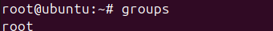
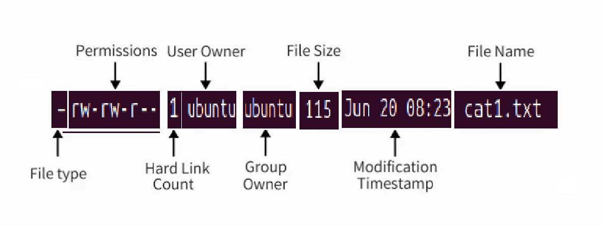
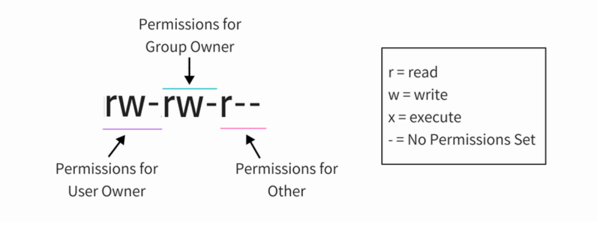
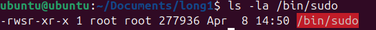
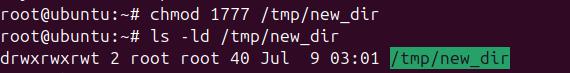
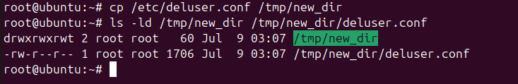

# VI. Permissions

Theo thiết kế, Linux là một hệ điều hành nhiều người dùng. Trong hệ thống doanh nghiệp, sẽ có nhiều người dùng truy cập vào cùng một hệ thống. Nhưng nếu bất kỳ người dùng nào có thể truy cập và sửa đổi tất cả các tệp thuộc về người dùng khác hoặc tệp hệ thống thì đây chắc chắn sẽ là một rủi ro bảo mật.

Đây là lý do tại sao UNIX và do đó Linux (Linux là một hệ thống giống Unix) có sẵn biện pháp bảo mật tích hợp. Điều này đảm bảo rằng chỉ những người dùng mong muốn mới có thể truy cập, sửa đổi hoặc thực thi một tệp hoặc thư mục.

Tệp nào sẽ được truy cập bởi người dùng nào được quyết định bởi hai yếu tố trong Linux:

* Quyền sở hữu tập tin
* Quyền tập tin

# Quyền sở hữu tệp trong Linux

Lưu ý: Tôi có thể sử dụng thuật ngữ file ở đây nhưng nó cũng có thể áp dụng cho các thư mục. Tôi đoán bạn biết rằng dù sao thì thư mục cũng là tập tin.

Mọi tệp và thư mục trong Linux đều có ba loại chủ sở hữu:

### Người dùng

Người dùng là chủ sở hữu của tập tin. Khi bạn tạo một tập tin, bạn trở thành chủ sở hữu của tập tin đó. Quyền sở hữu cũng có thể được thay đổi, nhưng chúng ta sẽ thấy điều đó sau.

### Nhóm

Mỗi người dùng là một phần của (các) nhóm nhất định. Một nhóm bao gồm một số người dùng và đây là một cách để quản lý người dùng trong môi trường nhiều người dùng.

Ví dụ: nếu bạn có nhóm dev, nhóm QA và nhóm sysadmin truy cập vào cùng một hệ thống, bạn nên tạo các nhóm riêng cho họ. Bằng cách này, bạn có thể quản lý tập tin và bảo mật của hệ thống một cách hiệu quả. Việc này giúp tiết kiệm thời gian vì thay vì thêm quyền cho từng người dùng theo cách thủ công, bạn chỉ cần thêm họ vào một nhóm và thay đổi quyền cho nhóm. Bạn sẽ thấy cách thực hiện điều đó sau trong bài viết này.

Ngay cả khi bạn là người dùng duy nhất của hệ thống, bạn vẫn sẽ là thành viên của nhiều nhóm. Các bản phân phối như Ubuntu cũng tạo một nhóm có tên trùng với tên người dùng.



### Khác

'Khác' có thể được coi là một nhóm lớn với tất cả người dùng trên hệ thống. Về cơ bản, bất kỳ ai có quyền truy cập vào hệ thống đều thuộc nhóm này.

Nói cách khác, “User” là một người dùng duy nhất, Group là tập hợp những người dùng và Other bao gồm tất cả những người dùng trên hệ thống.

# Quyền tập tin trong Linux

Mọi tệp và thư mục trong Linux đều có ba quyền sau đây cho cả ba loại chủ sở hữu:

**Quyền cho tập tin**

* read - Có thể xem hoặc sao chép nội dung tập tin
* write - Có thể sửa đổi nội dung tập tin
* execute - Có thể chạy tệp (nếu có thể thực thi được)

**Quyền cho các thư mục**

* read - Có thể liệt kê tất cả các tệp và sao chép các tệp từ thư mục
* write - Có thể thêm hoặc xóa tệp vào thư mục (cũng cần có quyền thực thi)
* execute – Có thể vào thư mục

# Hiểu quyền và quyền sở hữu tệp trong Linux

Bây giờ bạn đã biết thuật ngữ cơ bản về quyền và quyền sở hữu tệp, đã đến lúc xem nó hoạt động như thế nào.

Bạn có thể sử dụng “ [lệnh stat](https://linuxhandbook-com.translate.goog/stat-command/?_x_tr_sl=auto&_x_tr_tl=vi&_x_tr_hl=vi) ” hoặc “lệnh ls” để kiểm tra quyền của tệp.

Nếu bạn sử dụng lệnh ls với tùy chọn -l trên một tệp, bạn sẽ thấy kết quả như thế này:

```
-rwxrw-r-- 1 ubuntu ubuntu 115 Jun 20 08:23 cat1.txt
```



* **Loại tệp** : Biểu thị loại tệp. d có nghĩa là thư mục, – có nghĩa là tập tin thông thường, l có nghĩa là một liên kết tượng trưng.
* **Quyền** : Trường này hiển thị quyền được đặt trên một tệp.
* **Số lượng liên kết cứng** : Hiển thị xem tập tin có liên kết cứng hay không . Số lượng mặc định là một.
* **Người dùng** : Người dùng sở hữu các tập tin.
* **Group** : Nhóm có quyền truy cập vào file này. Tại một thời điểm chỉ có một nhóm có thể là chủ sở hữu của một tệp.
* **Kích thước tệp** : Kích thước của tệp tính bằng byte.
* **Thời gian sửa đổi** : Ngày và giờ file được sửa đổi lần cuối.
* **Tên tệp** : Rõ ràng là tên của tệp hoặc thư mục.

Bây giờ bạn đã hiểu đầu ra lệnh ls -l, hãy tập trung vào phần cấp phép tệp.

Trong lệnh trên, bạn thấy quyền của tệp như thế này ở **định dạng** chín chữ số :

```
rw-rw-r--
```

Mỗi chữ cái biểu thị một sự cho phép cụ thể:

* r: Quyền đọc
* w : Quyền viết
* x : Thực thi quyền
* – : Chưa đặt quyền

Các quyền luôn theo thứ tự đọc, viết và thực thi, tức là rwx. Và sau đó các quyền này được đặt cho cả ba loại chủ sở hữu (xem phần quyền sở hữu) theo thứ tự Người dùng, Nhóm và Khác.

Hình ảnh này sẽ giải thích mọi thứ tốt hơn:



Vì vậy, nếu bây giờ bạn nhìn vào hình trên, bạn có thể nói những điều sau đây về quyền của tệp:

* Tệp có quyền đọc, ghi và thực thi đối với chủ sở hữu Người dùng. Nhưng ai là chủ sở hữu của tập tin này? Bạn có thông tin này trong đầu ra của ls -l (tức là người dùng abhi).
* Tệp có quyền đọc và ghi cho Nhóm nhưng không thực thi. Đó là nhóm nào? Bạn có thông tin nhóm trong đầu ra của lệnh ls -l (tức là nhóm itsfoss).
* Tệp chỉ có quyền đọc đối với Người khác, tức là mọi người có quyền truy cập vào hệ thống. Bạn không cần biết đó là cái nào khác vì 'other' có nghĩa là tất cả người dùng.

## Thay đổi quyền truy cập tệp trong Linux

Bạn có thể sử dụng lệnh chmod để thay đổi quyền trên một tệp trong Linux.

Quyền từng được gọi là **chế độ truy cập** và do đó chmod là dạng viết tắt của **thay đổi chế độ truy cập** .

Có hai cách để sử dụng lệnh chmod:

* Chế độ tuyệt đối
* Chế độ tượng trưng

### Sử dụng chmod ở chế độ tuyệt đối

Ở chế độ tuyệt đối, các quyền được biểu diễn dưới dạng số (chính xác là hệ bát phân). Trong hệ thống này, mỗi quyền truy cập tệp được biểu thị bằng một số.

* r (đọc) = 4
* w (viết) = 2
* x (thực thi) = 1
* – (không được phép) = 0

Với các giá trị số này, bạn có thể kết hợp chúng và do đó, một số có thể được sử dụng để thể hiện toàn bộ bộ quyền.

| Con số            | Sự cho phép |
| ------------------ | ------------- |
| 0                  | —            |
| 1                  | –x           |
| 2                  | -w-           |
| 3 (tức là 2+1)   | -wx           |
| 4                  | r–           |
| 5 (tức là 4+1)   | rx            |
| 6 (tức là 4+2)   | rw-           |
| 7 (tức là 4+2+1) | rwx           |

Giả sử bạn muốn thay đổi quyền truy cập file trên cat.txt để mọi người đều có thể đọc và viết nhưng không ai có thể thực thi được? Trong trường hợp đó, bạn có thể sử dụng lệnh chmod như thế này:

```
chmod 666 cat.txt
```

Nếu bây giờ bạn liệt kê cat.txt, bạn sẽ thấy quyền đã được thay đổi.

```
-rw-rw-rw- 1 ubuntu ubuntu 457 Jun 10 11:55 cat.txt
```

### Sử dụng chmod ở chế độ tượng trưng

Vấn đề với chế độ tuyệt đối là bạn phải luôn cung cấp ba số cho cả ba chủ sở hữu ngay cả khi bạn muốn thay đổi quyền được đặt cho chỉ một chủ sở hữu.

Đây là nơi bạn có thể sử dụng chế độ biểu tượng bằng lệnh chmod.

Ở chế độ tượng trưng, chủ sở hữu được biểu thị bằng các ký hiệu sau:

* u = chủ sở hữu người dùng
* g = chủ nhóm
* o = khác
* a = tất cả (người dùng + nhóm + người khác)

Chế độ biểu tượng sử dụng các toán tử toán học để thực hiện các thay đổi về quyền:

* +: để thêm quyền
* -: để loại bỏ quyền
* = để ghi đè các quyền hiện có bằng giá trị mới

Bây giờ bạn đã biết, hãy xem cách sử dụng lệnh chmod ở chế độ tượng trưng.

Trong ví dụ trước của chúng tôi, nếu bạn muốn thêm quyền thực thi cho chủ sở hữu nhóm, bạn có thể sử dụng lệnh chmod như thế này:

```
chmod g+x cat.txt
```

Nếu bạn xem các quyền trên tệp này bây giờ, bạn sẽ thấy quyền thực thi đó hiện đã được thêm:

```
-rw-rwxrw- 1 ubuntu ubuntu 457 Jun 10 11:55 cat.txt
```

Bạn cũng có thể kết hợp nhiều thay đổi về quyền trong một lệnh. Giả sử bạn muốn loại bỏ quyền đọc ghi và thêm quyền thực thi cho Other. Bạn cũng muốn thêm quyền thực thi cho chủ sở hữu Người dùng. Bạn có thể thực hiện tất cả chỉ bằng một lệnh duy nhất:

```
chmod o-rw+x,u+x cat.txt
```

Các quyền kết quả sẽ như thế này:

```
-rwxrwx--x 1 ubuntu ubuntu 457 Jun 10 11:55 cat.txt
```

Nếu bạn muốn thay đổi quyền cho cả ba loại người dùng cùng một lúc, bạn có thể sử dụng nó theo cách sau:

```
chmod a-x cat.txt
```

Điều này sẽ loại bỏ quyền thực thi cho tất cả mọi người.

```
-rw-rw---- 1 ubuntu ubuntu 457 Jun 10 11:55 cat.txt
```

## Thay đổi quyền sở hữu tệp trong Linux

Để thay đổi quyền sở hữu một tập tin, bạn có thể sử dụng [lệnh chown](https://translate.google.com/website?sl=auto&tl=vi&hl=vi&u=https://linux.die.net/man/1/chown) . Bạn có thể dễ dàng đoán rằng chown là viết tắt của thay đổi chủ sở hữu.

Bạn có thể thay đổi chủ sở hữu người dùng của tệp theo cách sau:

```
chown <new_user_name> <filename>
```

Nếu bạn muốn thay đổi người dùng cũng như nhóm, bạn có thể [sử dụng lệnh chown như sau](https://linuxhandbook-com.translate.goog/chown-command/?_x_tr_sl=auto&_x_tr_tl=vi&_x_tr_hl=vi) :

```
chown <new_user_name>:<new_user_group> <filename>
```

Nếu bạn chỉ muốn thay đổi nhóm, bạn có thể sử dụng lệnh chown theo cách này:

```
chown :<new_user_group> <filename>
```

hoặc [sử dụng lệnh chgrp](https://linuxhandbook-com.translate.goog/chgrp-command/?_x_tr_sl=auto&_x_tr_tl=vi&_x_tr_hl=vi) được sử dụng riêng để thay đổi chủ sở hữu nhóm của tệp hoặc thư mục. Bạn có thể đoán rằng [chgrp](https://translate.google.com/website?sl=auto&tl=vi&hl=vi&u=https://linux.die.net/man/1/chgrp) là viết tắt của nhóm thay đổi.

```
chgrp <new_user_group> <filename>
```

Trong ví dụ của chúng tôi cho đến nay, nếu bạn muốn thay đổi chủ sở hữu người dùng và nhóm thành root, bạn có thể sử dụng lệnh chown như sau:

```
sudo chown root:root agatha.txt
```

Điều này sẽ thay đổi quyền sở hữu tệp thành root cho cả người dùng và nhóm.

```
-rw-rw---- 1 root root 457 Aug 10 11:55 agatha.txt
```

Lưu ý rằng tôi phải sử dụng sudo với chown? Đó là vì root có liên quan ở đây và để xử lý root, bạn cần có quyền siêu người dùng.

> **Mẹo** : Hai nhóm không thể sở hữu cùng một tệp. 

### Mẹo bổ sung: Có quyền ưu tiên đối với quyền đối với tệp không?

Hãy nghĩ đến một tình huống, trong đó chủ sở hữu người dùng không có bất kỳ quyền nào, nhóm có quyền đọc trong khi những người khác có quyền đọc và ghi.

```
----r--rw- 1 abhi itsfoss 457 Aug 10 11:55 agatha.txt
```

Bây giờ, nếu người dùng abhi cố gắng đọc tệp bằng cat hoặc [less command](https://linuxhandbook-com.translate.goog/less-command/?_x_tr_sl=auto&_x_tr_tl=vi&_x_tr_hl=vi) , liệu anh ta có thể làm được không? Câu trả lời là không vì nó không có quyền đọc.

Nhưng người dùng abhi là thành viên của nhóm itsfoss và nhóm có quyền truy cập đọc. Chết tiệt! người khác có quyền đọc và viết. Điều này có nghĩa là tất cả mọi người (kể cả người dùng abhi) đều có thể đọc và ghi tệp, phải không? Sai!

Trong Linux, quyền ưu tiên lấy từ người dùng, sau đó đến nhóm rồi đến người khác. Hệ thống Linux kiểm tra xem ai đã bắt đầu quá trình (trong ví dụ của chúng tôi là cat hoặc less).

Nếu người dùng bắt đầu quá trình cũng là chủ sở hữu người dùng của tệp thì các bit quyền của người dùng sẽ được đặt.

Nếu chủ sở hữu tệp không bắt đầu quá trình thì hệ thống Linux sẽ kiểm tra nhóm. Nếu người dùng bắt đầu quá trình ở cùng nhóm với nhóm chủ sở hữu của tệp, bit quyền của nhóm sẽ được đặt.

Nếu chủ sở hữu quy trình này thậm chí không nằm trong nhóm với tư cách là chủ sở hữu nhóm của tệp thì các bit quyền khác sẽ được đặt.

## Quyền tệp Linux đặc biệt

Bit **setuid** thể hiện quyền đối với một tệp thực thi mà người dùng khác có thể chạy với sự cho phép của chủ sở hữu. Ví dụ: khi người dùng **max** chạy lệnh vi với tư cách là người dùng  **john** , bạn sẽ có quyền đọc/ghi của  **john** .

Để xác định các tệp có setuid, hãy sử dụng lệnh **ls **và tìm bit **s **thay cho bit thực thi **x, **như sau.

### Đặt bit UID

Bit **setuid** thể hiện quyền đối với một tệp thực thi mà người dùng khác có thể chạy với sự cho phép của chủ sở hữu. Chẳng hạn, khi người dùng **max** chạy lệnh vi với tư cách  **root** , anh ta sẽ có quyền đọc/ghi của  **root** . Để xác định tệp bằng setuid.



Để đặt bit setuid cho các tệp thực thi, hãy sử dụng lệnh chmod như sau:

```undefined
chmod u+s /etc/passwd
```

Để xóa quyền thực thi các tệp khỏi người dùng hoặc chủ sở hữu không phải root:

```undefined
chmod u-s /etc/passwd
```

### Đặt bit GID

Như đã thảo luận, bit set uid kiểm soát quyền truy cập tệp của những người dùng khác, trong khi bit setgid (GID) tạo các thư mục cộng tác. Điều đó có nghĩa là bất kỳ tệp nào được tạo bên trong thư mục đó đều có thể truy cập được vào nhóm của thư mục. Do đó, nó cho phép tất cả thành viên nhóm chạy các tệp thực thi mà không cần có đặc quyền của chủ sở hữu và bảo vệ chúng khỏi những người dùng khác.

### Sticky Bit

Không giống như các bit SID và GID, các bit dính khác nhau về chức năng vì nó bảo vệ các tệp và thư mục khỏi bị người dùng khác đổi tên và xóa. Quyền đối với tệp thông thường cho phép bất kỳ người dùng nào có quyền ghi để xóa hoặc đổi tên tệp. Trong khi đó với tập bit dính, điều đó là không thể trừ khi bạn là người dùng root hoặc chủ sở hữu của tệp.

Trường hợp lý tưởng để sử dụng các bit cố định là thư mục có thể truy cập được đối với tất cả người dùng để tạo tệp. Chẳng hạn, sử dụng lệnh **ls -ld** để kiểm tra quyền đối với thư mục  **\tmp** , như sau:

Bạn có thể nhận thấy rằng bit dính **t** thay thế bit thực thi  **x** . Thực hiện theo bộ hướng dẫn nhất định để tạo thư mục xóa bị hạn chế:





Bạn có thể nhận thấy bit dính thay vì bit thực thi, có nghĩa là chỉ người gốc hoặc người dùng john mới có thể xóa tệp vì tệp nằm trong thư mục bit dính.

# tài liệu tham khảo

[Đặt UID, Nhận UID và Bit dính trong Quyền của tệp Linux là gì? (linux-console.net)](https://vi.linux-console.net/?p=10631)

[Linux File Permissions and Ownership Explained with Examples (linuxhandbook.com)](https://linuxhandbook.com/linux-file-permissions/)
