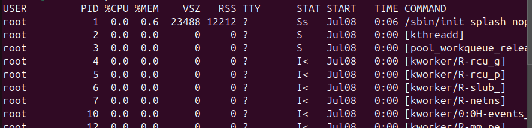
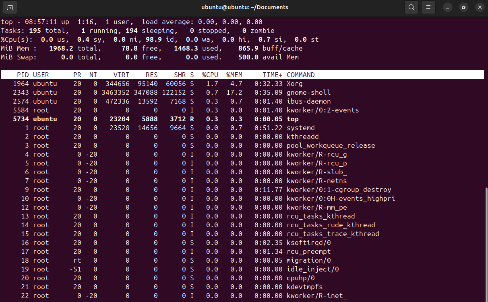

# VI. Tiến trình

Khái niệm cơ bản về tiến trình trong Linux

Mọi thứ chạy trên hệ thống của bạn đều được chạy thông qua một thứ được gọi là tiến trình, đơn giản đó là phiên bản đang chạy của một chương trình.

Tất cả các tiến trình chạy trên hệ thống của bạn đều được gán các mã định danh. Những điều này có thể hữu ích nếu bạn muốn theo dõi quá trình (chẳng hạn như để xem nó đang sử dụng bao nhiêu bộ nhớ hoặc CPU) hoặc có thể nếu bạn muốn kết thúc nó nếu nó bắt đầu bị treo hoặc chỉ hoạt động hơi khó chịu.
Các mã định danh gắn liền với tất cả các quy trình này được gọi là PID và PPID.

PID (process ID) là viết tắt của "ID tiến trình". Đây chỉ đơn giản là mã định danh được gắn vào chương trình khi chương trình bắt đầu chạy và có thể hữu ích nếu bạn cần tương tác với quy trình theo cách này hay cách khác.

PPID có liên quan khá chặt chẽ với PID. PPID (parent process ID) là viết tắt của "ID tiến trình gốc" và nếu bạn chưa có mã này thì nó chỉ đơn giản là viết tắt của tiến trình đã tạo ra tiến trình mà bạn đang kiểm tra.

Có nhiều cách để lấy PID (ID tiến trình) và PPID (ID tiến trình gốc) của một quy trình nhất định trong Linux.

| Command            | Description                     |
| ------------------ | ------------------------------- |
| pidof process_name | Works with exact process name   |
| pgrep process_name | Returns PID of all matches      |
| ps -o ppid= -p PID | Get the PPID from PID           |
| $$                 | PID of current process/shell    |
| ${PPID}            | PID of current process's parent |

## a. ps command

Là lệnh tiêu chuẩn mà hầu hết các quản trị viên hệ thống sử dụng trong hệ điều hành giống UNIX.

Có một số tùy chọn mà bạn có thể sử dụng với `ps `lệnh, nhưng tập hợp các tùy chọn để sử dụng khi bạn muốn có danh sách **tất cả các quy trình** là `aux`.

* `a`: Hiển thị thông tin về quy trình của người dùng khác cũng như của chính người dùng đó (nếu quy trình được kết nối với thiết bị đầu cuối, tức là daemon bị loại trừ)
* `u`: Hiển thị ở định dạng người dùng có thể đọc được
* `x`: Bao gồm các tiến trình không được kết nối với thiết bị đầu cuối, tức là bao gồm các daemon



**VSZ (Virtual Memory Size)** :

* Là kích thước tổng cộng của bộ nhớ ảo mà tiến trình đã cấp phát, tính bằng kilobytes (KB).
* Bao gồm tất cả các phần bộ nhớ mà tiến trình có thể truy cập, bao gồm cả bộ nhớ trên đĩa và bộ nhớ swap.
* Giá trị này bao gồm cả các thư viện dùng chung, bộ nhớ được ánh xạ, và bộ nhớ không cư trú thực sự trong RAM.

**RSS (Resident Set Size)** :

* Là kích thước bộ nhớ thực tế mà tiến trình đang sử dụng trong RAM, tính bằng kilobytes (KB).
* Đây là phần bộ nhớ cư trú thực sự trong RAM mà không bị swap ra đĩa.
* Giá trị này chỉ bao gồm bộ nhớ vật lý được tiến trình sử dụng, không bao gồm bộ nhớ ảo.

**TTY (Teletypewriter)** :

* Là tên của thiết bị đầu cuối (terminal) mà tiến trình đang liên kết hoặc đã được khởi chạy từ đó.
* Nếu tiến trình không liên kết với một thiết bị đầu cuối, cột TTY sẽ hiển thị "?".
* TTY giúp xác định tiến trình nào đang chạy trong phiên làm việc nào trên thiết bị đầu cuối nào.

Cột `STAT` trong đầu ra của lệnh `ps` hiển thị trạng thái hiện tại của mỗi tiến trình. Đây là một chuỗi ký tự đại diện cho các thông tin trạng thái khác nhau của tiến trình. Các ký tự thông dụng trong cột `STAT` bao gồm:

1. **Trạng thái chính của tiến trình** :

* **R (Running)** : Tiến trình đang chạy hoặc sẵn sàng để chạy.
* **S (Sleeping)** : Tiến trình đang chờ một sự kiện để tiếp tục (trạng thái ngủ ngắn hạn).
* **D (Uninterruptible sleep)** : Tiến trình đang trong trạng thái ngủ không ngắt được, thường là đang chờ truy cập vào ổ đĩa hoặc tài nguyên phần cứng khác.
* **T (Stopped)** : Tiến trình đã bị dừng, có thể là do tín hiệu điều khiển như `SIGSTOP`.
* **Z (Zombie)** : Tiến trình đã kết thúc nhưng vẫn còn trong bảng tiến trình vì tiến trình cha chưa thu thập thông tin kết thúc của nó.

1. **Các ký tự bổ sung** :

* **<** : Tiến trình có ưu tiên cao hơn thông thường.
* **N** : Tiến trình có ưu tiên thấp hơn thông thường.
* **L** : Tiến trình có các trang bộ nhớ bị khóa vào bộ nhớ (không thể swap).
* **s** : Tiến trình là một tiến trình dẫn đường (session leader).
* **l** : Tiến trình đa luồng (multi-threaded).
* **+** : Tiến trình đang nằm trong foreground của phiên làm việc.

> Tiến trình chạy trong tiền cảnh là tiến trình hiện tại đang tương tác trực tiếp với người dùng qua terminal.


Một **Session Leader** (tiến trình dẫn đường của phiên làm việc) là một tiến trình đặc biệt trong hệ thống Unix/Linux. Nó là tiến trình đầu tiên trong một phiên làm việc (session) và có trách nhiệm quản lý các tiến trình khác trong cùng một phiên làm việc. Phiên làm việc là một nhóm các tiến trình có liên kết với nhau và thường chia sẻ cùng một thiết bị đầu cuối (terminal).

**Đặc điểm của Session Leader:**

**Tiến trình đầu tiên trong phiên** :

* Khi một phiên làm việc mới được tạo ra, tiến trình đầu tiên khởi tạo phiên làm việc đó trở thành Session Leader.
* Thông thường, một shell (như bash) khởi chạy khi bạn mở một terminal mới sẽ trở thành Session Leader.

**Quản lý các tiến trình trong phiên** :

* Session Leader có thể tạo ra các tiến trình con, và các tiến trình con này sẽ trở thành một phần của cùng phiên làm việc.
* Nếu Session Leader bị kết thúc, các tiến trình con có thể tiếp tục chạy hoặc cũng bị kết thúc tùy thuộc vào cách quản lý tín hiệu.

## b. top command

\- Lệnh top cùng hiển thị danh sách các tiến trình đang chạy trên hệ thống theo thời gian thực. Nó cũng hiển thị thông tin bổ sung về thời gian hoạt động của hệ thống, mức sử dụng CPU và bộ nhớ hiện tại hoặc tổng số tiến trình đang chạy và cho phép bạn thực hiện các hành động như sắp xếp danh sách hoặc hủy một tiến trình.
\- Để chạy lệnh top, gõ lệnh sau tại dấu nhắc shell: top
\- Đối với mỗi quy trình được liệt kê, lệnh trên cùng hiển thị ID tiến trình (PID), tên người dùng hiệu quả của chủ sở hữu quy trình (USER), mức độ ưu tiên (PR), giá trị Nice (NI), dung lượng bộ nhớ ảo mà quy trình sử dụng ( VIRT), dung lượng bộ nhớ vật lý không được hoán đổi mà tiến trình sử dụng (RES), dung lượng bộ nhớ dùng chung mà tiến trình sử dụng (SHR), trường trạng thái tiến trình S), tỷ lệ phần trăm của CPU (%CPU) và bộ nhớ (% MEM), thời gian CPU tích lũy (TIME+) và tên của tệp thực thi (COMMAND). Ví dụ:


## c. kill command

\- Lệnh 'kill' trong Linux là một công cụ mạnh mẽ, đặc biệt khi bạn cần quản lý các tiến trình không phản hồi hoặc tiêu tốn quá nhiều tài nguyên hệ thống. Về cơ bản nhất, lệnh 'kill' được sử dụng để chấm dứt các tiến trình.
\- Syntax kill một tiến trình: `kill PID`
\- Khi bạn trở nên quen thuộc hơn với lệnh 'kill' trong Linux, bạn sẽ thấy rằng nó mang lại nhiều lợi ích hơn là chỉ chấm dứt các quy trình. Lệnh 'kill' có thể gửi các loại tín hiệu khác nhau đến các tiến trình, có thể được sử dụng để kiểm soát chúng theo nhiều cách khác nhau.Dưới đây là bảng chứa một số tín hiệu được sử dụng phổ biến nhất:

| Signal  | Description                                                                                     | Example            |
| :------ | :---------------------------------------------------------------------------------------------- | :----------------- |
| SIGTERM | Requests a process to terminate but allows it to perform cleanup operations before terminating. | kill -SIGTERM 1234 |
| SIGKILL | Forces a process to terminate immediately.                                                      | kill -SIGKILL 1234 |
| SIGSTOP | Pauses a process.                                                                               | kill -SIGSTOP 1234 |
| SIGCONT | Resumes a paused process.                                                                       | kill -SIGCONT 1234 |
| SIGHUP  | Sends a signal to a process when the terminal controlling it is closed.                         | kill -SIGHUP 1234  |
| SIGINT  | Sends an interrupt signal, usually initiated by the user.                                       | kill -SIGINT 1234  |
| SIGQUIT | Sends a quit signal, which often results in a core dump.                                        | kill -SIGQUIT 1234 |
| SIGABRT | Sends an abort signal, which often results in a core dump.                                      | kill -SIGABRT 1234 |
| SIGALRM | Used to alarm/countdown.                                                                        | kill -SIGALRM 123  |

## d. Nice and Renice in linux

\- Lệnh Nice trong Linux giúp thực thi một chương trình/quy trình với mức độ ưu tiên lập lịch đã được sửa đổi. Nó khởi chạy một quy trình với mức độ ưu tiên lập lịch do người dùng xác định. Trong trường hợp này, nếu chúng ta ưu tiên một tiến trình cao hơn thì Kernel sẽ phân bổ nhiều thời gian CPU hơn cho tiến trình đó. Trong khi đó lệnh renice cho phép bạn thay đổi và sửa đổi mức độ ưu tiên lập lịch của một quy trình đang chạy. Hạt nhân Linux lên lịch cho quá trình và phân bổ thời gian CPU phù hợp cho từng quy trình.

Mức độ ưu tiên của lệnh này đi từ -20 đến 19, trong đó -20 có nghĩa là mức độ ưu tiên cao nhất và do đó, càng nhiều công suất CPU càng tốt, cho đến 19 là giá trị thấp nhất có thể và do đó việc phân công công suất CPU ít hơn.

### Nice

Để sử dụng lệnh Nice, bạn phải root hoặc có khả năng sudo trong hệ thống, vì đây là một lệnh rất tinh vi.

Giả sử bạn đã root, bạn sẽ gõ:

```
nice -n 12 <command>
```

Điều này sẽ cho hệ thống biết rằng bạn muốn chạy <lệnh>, sử dụng mức ưu tiên là 12 ( **10 là mặc định nếu bạn không nhập bất kỳ giá trị nào** ). Về cơ bản, nó sẽ nằm ở vị trí thấp trong danh sách ưu tiên và do đó sẽ không hút hết sức mạnh của CPU.

### Renice

Giả sử bạn bắt đầu chạy một tiến trình bằng lệnh Nice, nhưng sau một thời gian bạn muốn thay đổi nó, mặc dù bạn cần tiến trình đó tiếp tục chạy chứ không phải tắt hoặc khởi động lại nó. Đây là lúc lệnh 'renice' của bạn xuất hiện.

Lệnh 'renice' có thể được sử dụng theo cách rất giống và sử dụng khái niệm giống như lệnh Nice, tuy nhiên, nó nhằm mục đích thay đổi mức độ ưu tiên

Vì vậy, nếu bạn đang chạy một lệnh với Nice, bạn có thể sửa đổi mức độ ưu tiên của nó bằng renice theo cách sau (một lần nữa, chạy nó với tư cách người dùng root):

```
renice -n -10 <command>
```

Điều này sẽ thay đổi mức độ ưu tiên trước đó của quy trình để trở nên quan trọng hơn, do đó có nhiều sức mạnh hơn (-10).

Bạn thậm chí có thể sử dụng nó cho tất cả quy trình thuộc về một người dùng cụ thể, ví dụ:

```
renice -n -10 -u helder
```

Điều này sẽ thay đổi mức độ ưu tiên của tất cả các quy trình thuộc về người dùng *.*

Tương tự, bạn có thể sử dụng các tùy chọn như -p và [chỉ định ID tiến trình](https://linuxhandbook-com.translate.goog/find-process-id/?_x_tr_sl=auto&_x_tr_tl=vi&_x_tr_hl=vi) (hoặc pid) hoặc -g và sử dụng id nhóm của các tiến trình.

# tài liệu tham khảo

[Check All Running Process in Linux (linuxhandbook.com)](https://linuxhandbook.com/check-running-process/)
