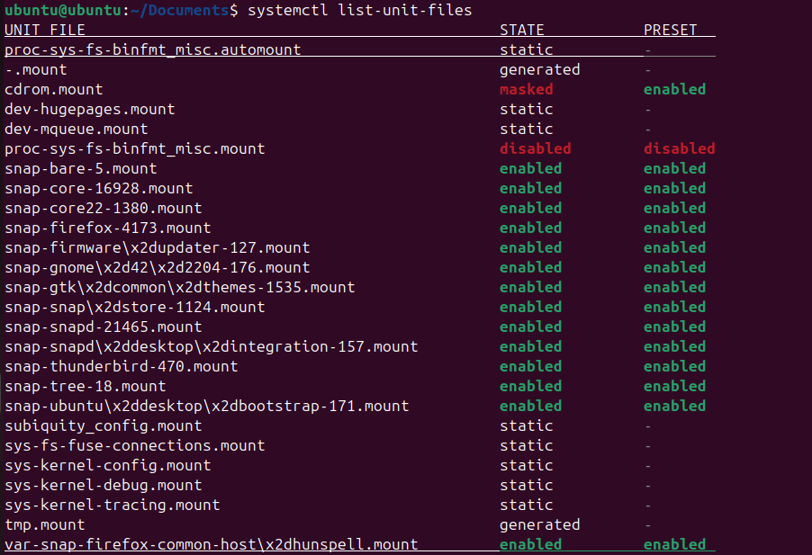

# VII. Systemctl

## a. Systemd

Mọi bản phân phối Linux chính thống bao gồm Ubuntu, Fedora, openSUSE và RedHat đều sử dụng systemd làm hệ thống init của chúng.

Nói một cách đơn giản, hệ thống init được sử dụng để quản lý các dịch vụ trong Linux và systemctl là một công cụ được sử dụng để tương tác với systemd.

Nhưng systemd là một nhóm các chương trình đặc biệt sẽ quản lý, vận hành và theo dõi các tiến trình khác hoạt động.

Về cơ bản thì **systemd** tương đương với một chương trình quản lý hệ thống và các dịch vụ trong Linux. Nó cung cấp một số các tiện ích như sau

* `systemctl` dùng để quản lý trạng thái của các dịch vụ hệ thống (bắt đầu, kết thúc, khởi động lại hoặc kiểm tra trạng thái hiện tại)
* `journald` dùng để quản lý nhật ký hoạt động của hệ thống (hay còn gọi là ghi log)
* `logind` dùng để quản lý và theo dõi việc đăng nhập/đăng xuất của người dùng
* `networkd` dùng để quản lý các kết nối mạng thông qua các cấu hình mạng
* `timedated` dùng để quản lý thời gian hệ thống hoặc thời gian mạng
* `udev` dùng để quản lý các thiết bị và firmware

### unit file

Tất cả các chương trình được quản lý bởi **systemd** đều được thực thi dưới dạng `daemon` hay `background` bên dưới nền và được cấu hình thành 1 file configuration gọi là **unit** file. Các **unit** file này sẽ bao gồm 12 loại:

* service (các file quản lý hoạt động của 1 số chương trình)
* socket (quản lý các kết nối)
* device (quản lý thiết bị)
* mount (gắn thiết bị)
* automount (tự đống gắn thiết bị)
* swap (vùng không gian bộ nhớ trên đĩa cứng)
* target (quản lý tạo liên kết)
* path (quản lý các đường dẫn)
* timer (dùng cho cron-job để lập lịch)
* snapshot (sao lưu)
* slice (dùng cho quản lý tiến trình)
* scope (quy định không gian hoạt động)

### service file

Mặc dù là có 12 loại unit file trong  **systemd** , tuy nhiên có lẽ `service` là loại thường được quan tâm nhất. Loại này sẽ được khởi động khi bật máy và luôn chạy ở chế độ nền (`daemon` hoặc `background`) Các service thường sẽ được cấu hình trong các file riêng biệt và được quản lý thông qua câu lệnh `systemctl` Ta có thể sử dụng câu lệnh sau để xem các `service` đã được kích hoạt bởi hệ thống: `systemctl list-units | grep -e '.service'` hoặc `systemctl -t service` Bộ ba tùy chọn quen thuộc của `systemctl` sẽ dùng khi muốn bật/tắt một service

* `start`: bật service
* `stop`: tắt service
* `restart`: tắt service rồi bật lại (ngoài ra còn có `reload` để tải lại file cấu hình tuy nhiên chỉ có 1 số chương trình hỗ trợ như Apache/Nginx ...) Ba tùy chọn trên sẽ được sử dụng khi hệ thống đang hoạt động, tuy nhiên `systemctl` cũng cung cấp 2 tùy chọn khác để điều khiển việc hoạt động của service từ lúc khởi động hệ thống
* `enable`: service sẽ được khởi động cùng hệ thống
* `disable`: service sẽ không được khởi động cùng hệ thống

## b. Systemctl

Systemctl được sử dụng để kiểm soát systemd và quản lý các dịch vụ. Nó là một phần của hệ sinh thái systemd và có sẵn theo mặc định trên tất cả các hệ thống.

Với Systemctl bạn có thể kiểm tra được trạng thái của các service, khởi động và tắt service, gỡ rối hệ thống khi xảy ra sự cố.

## c. Cách quản lý dịch vụ hệ thống trong Linux

Để xem được các dịch vụ đã được enable hay disable thì phải dùng lệnh `systemctl list-unit-files`:

> nhấn 'q' để có thể thoát khỏi giao diện này

* **Khởi động hoặc dừng service**
  \- Khởi động: `systemctl start [service]`
  \- Dừng: `systemctl stop [service]`
* **Kích hoạt và vô hiệu hóa service**
  \- Kích hoạt: `systemctl enable [service]`
  \- Vô hiệu hóa: `systemctl disable [service]`
* **Xem trạng thái service**
  \- Xem trạng thái service: `systemctl status [service]`

> Dòng 1 là mô tả service (đọc từ /lib/systemd/system/ssh.service)
> Dòng 2 mô tả trạng thái load

| **Trạng thái** | **Sự miêu tả**                                                                                                        |
| ---------------------- | ------------------------------------------------------------------------------------------------------------------------------ |
| active (running)       | Dịch vụ đang tích cực chạy ở chế độ nền.                                                                            |
| active (exited)        | Dịch vụ này được thực hiện một lần hoặc định kỳ và sẽ thoát sau khi hoàn thành.                             |
| active (waiting)       | Dịch vụ đang chạy nhưng đang chờ được kích hoạt bởi một điều kiện hoặc sự kiện cụ thể.                   |
| inactive               | Dịch vụ hiện không chạy.                                                                                                  |
| enable                 | Dịch vụ sẽ được tự động khởi động vào thời điểm khởi động hệ thống.                                       |
| disabled               | Dịch vụ bị vô hiệu hóa và sẽ không khởi động được khi khởi động hệ thống.                                  |
| static                 | Không thể quản lý dịch vụ này bằng lệnh systemd hoặc systemctl; bạn cần phải quản lý nó một cách thủ công. |
| masked                 | Dịch vụ bị ẩn và không thể khởi động được (cần phải được hiển thị để dịch vụ hoạt động).            |
| alias                  | Tên dịch vụ là bí danh và dịch vụ là một liên kết tượng trưng trỏ đến một tệp đơn vị khác.             |
| linked                 | Tệp dịch vụ hoặc đơn vị được liên kết tượng trưng với tệp đơn vị khác.                                    |

* **Khởi động lại và tải lại service**
  \- Khởi động lại: `systemctl restart [service]`
  \- Tải lại: `systemctl reload [service]`
* **Masking hoặc unmasking service**
  Khi một dịch vụ được mask, nó sẽ bị "giấu đi" và không thể được khởi động hoặc tương tác với bằng systemctl. Đây là một cách an toàn để ngăn chặn hoặc ngăn chặn sự khởi động của một dịch vụ mà bạn không muốn hoạt động trên hệ thống của mình.
  Còn khi unmask một dịch vụ, nó sẽ được phục hồi và có thể được quản lý như bình thường bằng systemctl.
  \- Masking: `systemctl mask [service]`
  \- Unmasking: `systemctl unmask [service]`
* **Thay đổi Default Target**
  Target là một nhóm các dịch vụ được systemd quản lý, và chúng thường được sử dụng để định nghĩa các trạng thái hoạt động của hệ thống, chẳng hạn như multi-user.target cho môi trường đa người dùng hoặc graphical.target cho môi trường đồ họa.
  \- Cú pháp:  `systemctl set-default [target]`
* **Liệt kê Unit Files**
  \- Cú pháp:  `systemctl list-unit-files`
* **Masking hoặc unmasking unit file**
  Ta đã thấy trong phần quản lý dịch vụ cách dừng hoặc vô hiệu hóa một dịch vụ, nhưng systemd cũng có khả năng đánh dấu một đơn vị là hoàn toàn không thể khởi động, tự động hoặc thủ công, bằng cách liên kết nó với /dev/null . Điều này được gọi là tạo mặt nạ cho đơn vị và có thể thực hiện được với lệnh mask :

  \- Masking: `systemctl mask [unit-file]` \- Unmasking: `systemctl unmask [unit-file]`

## d. Cấu trúc tệp tin service

  FIle service gồm 3 thành phần chính là `[Unit]`, `[Service]`, `[Install]`
  Ví dụ:
  

**Phần Unit:** Chứa các thông tin về unit bao gồm mô tả, các phụ thuộc,....

| Option        | Description                                                                                                                                                                       |
| :------------ | :-------------------------------------------------------------------------------------------------------------------------------------------------------------------------------- |
| Description   | Một mô tả ngắn gọn về unit                                                                                                                                                  |
| Documentation | Liên kết đến tài liệu liên quan hoặc trang man.                                                                                                                           |
| Before, After | Thứ tự các đơn vị được bắt đầu.                                                                                                                                       |
| Requires      | Chỉ định các đơn vị khác mà dịch vụ này phụ thuộc. Nếu các đơn vị được liệt kê không khởi động được, dịch vụ này cũng sẽ không khởi động. |
| Wants         | Giống như `Requires`, nhưng nhẹ hơn. Nếu các đơn vị liệt kê không khởi động được, dịch vụ này vẫn có thể khởi động.                                 |
| Conflicts     | Nếu một thiết bị có cài đặt Conflicts trên một thiết bị khác, việc khởi động thiết bị trước sẽ dừng thiết bị sau và ngược lại.                       |

Danh sách những tùy chọn phần [Unit]: `man systemd.unit`
**Phần Service:** Xác định các service được chạy, bao gồm đường dẫn,...

| Option          | Description                                                                                                                                                                                                                                                                                                                                                                                                                                                                                                                                                                                                                                                                                                                                                                                                                                                                                                                                                                                                                                                            |
| :-------------- | :--------------------------------------------------------------------------------------------------------------------------------------------------------------------------------------------------------------------------------------------------------------------------------------------------------------------------------------------------------------------------------------------------------------------------------------------------------------------------------------------------------------------------------------------------------------------------------------------------------------------------------------------------------------------------------------------------------------------------------------------------------------------------------------------------------------------------------------------------------------------------------------------------------------------------------------------------------------------------------------------------------------------------------------------------------------------- |
| Type            | Định cấu hình kiểu khởi động quy trình. Một trong: **simple** (default) - bắt đầu dịch vụ ngay lập tức. Dự kiến quy trình chính của dịch vụ được xác định trong **ExecStart**.   **forking** – coi như dịch vụ đã khởi động sau khi tiến trình rẽ nhánh và tiến trình gốc đã thoát.   **oneshot** – tương tự như simple, nhưng dự kiến quy trình phải thoát trước khi systemd khởi động các đơn vị tiếp theo (hữu ích cho các tập lệnh thực hiện một công việc duy nhất rồi thoát ra).  **dbus** - tương tự như simple, nhưng coi dịch vụ đã khởi động khi quy trình chính có tên D-Bus.   **notify** - tương tự như simple, nhưng coi dịch vụ chỉ khởi động sau khi nó gửi tín hiệu đặc biệt đến systemd.  **idle** - tương tự như simple, nhưng việc thực thi thực tế nhị phân dịch vụ bị trì hoãn cho đến khi tất cả công việc hoàn thành. |
| ExecStart       | Chỉ định lệnh được sử dụng để khởi động dịch vụ.                                                                                                                                                                                                                                                                                                                                                                                                                                                                                                                                                                                                                                                                                                                                                                                                                                                                                                                                                                                                       |
| ExecReload      | Chỉ định lệnh được sử dụng để dừng dịch vụ.                                                                                                                                                                                                                                                                                                                                                                                                                                                                                                                                                                                                                                                                                                                                                                                                                                                                                                                                                                                                              |
| Restart         | Khi bật tùy chọn này, dịch vụ sẽ được khởi động lại khi quá trình dịch vụ thoát, bị hủy hoặc hết thời gian chờ ngoại trừ lệnh dừng bình thường bằng lệnh**systemctl stop**.                                                                                                                                                                                                                                                                                                                                                                                                                                                                                                                                                                                                                                                                                                                                                                                                                                                    |
| RemainAfterExit | Nếu được đặt thành**True**, dịch vụ được coi là hoạt động ngay cả khi tất cả các quá trình của dịch vụ đó đã thoát. Hữu ích với **Type=oneshot**. Giá trị mặc định là **False**.                                                                                                                                                                                                                                                                                                                                                                                                                                                                                                                                                                                                                                                                                                                                                                                                                              |

Danh sách những tùy chọn phần [Service]: `man systemd.service`
**Phần Install:** Liên quan đến các service sẽ được cài đặt...Danh sách các tùy chọn phần [Install]: `man systemd.install`

| Option               | Description                                                                                                                                                                                                                  |
| :------------------- | :--------------------------------------------------------------------------------------------------------------------------------------------------------------------------------------------------------------------------- |
| Alias                | Danh sách tên bổ sung được phân tách bằng dấu cách cho đơn vị. Hầu hết các lệnh**systemctl**, ngoại trừ **systemctl enalbe**, có thể sử dụng bí danh thay vì tên đơn vị thực tế. |
| RequiredBy, WantedBy | Dịch vụ hiện tại sẽ được bắt đầu khi các dịch vụ được liệt kê được bắt đầu.                                                                                                                         |
| Also                 | Chỉ định danh sách các đơn vị sẽ được bật hoặc tắt cùng với đơn vị này khi người dùng chạy**systemctl enable** hoặc **systemctl disable**.                                             |

# Tài liệu tham khảo

[Cấu trúc tập tin service](https://www.shellhacks.com/systemd-service-file-example/)
